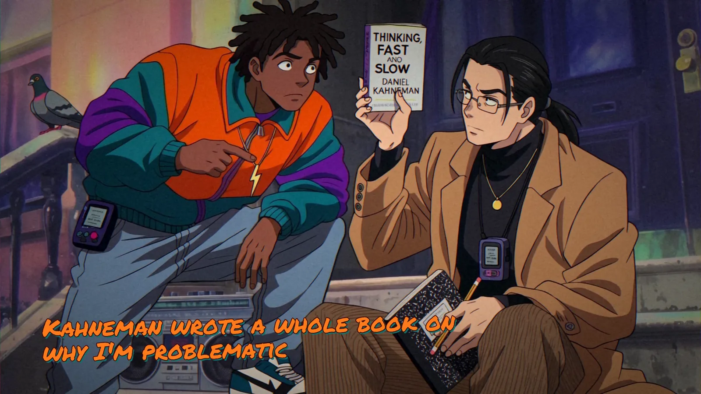
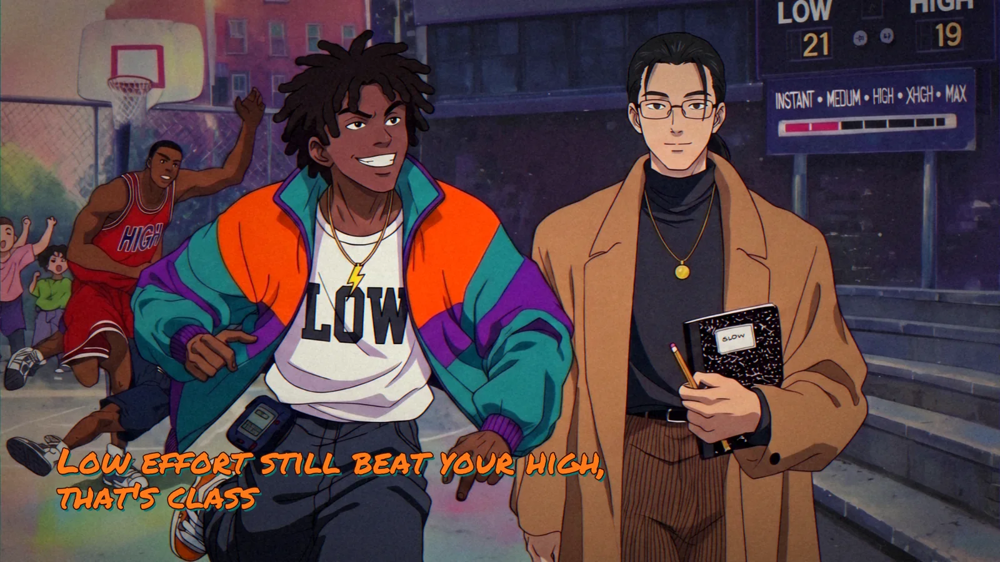
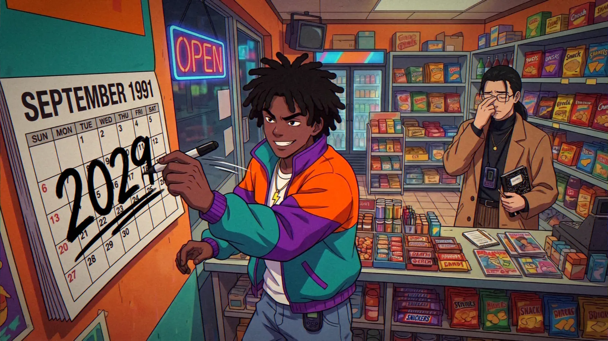
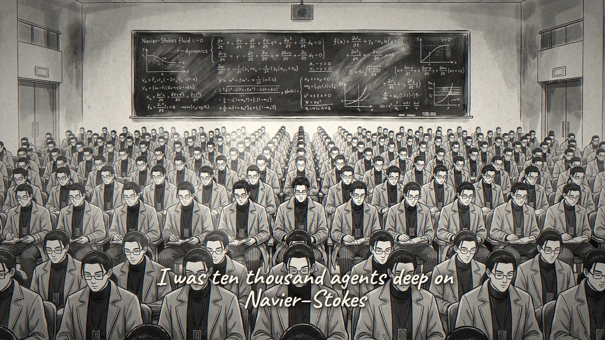
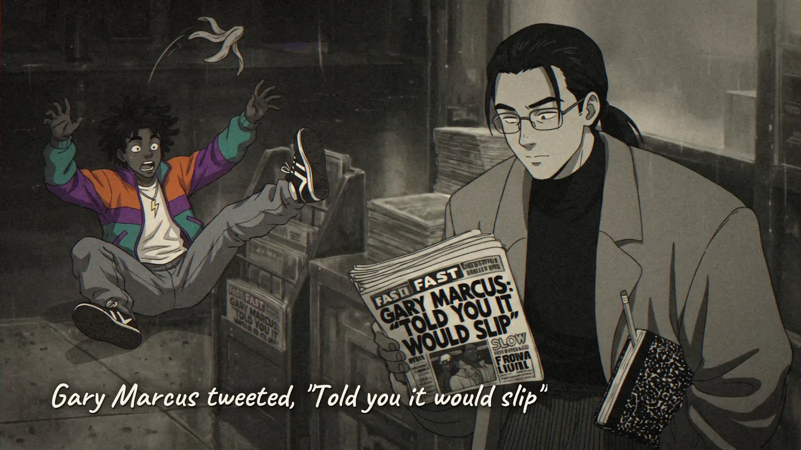

# Sometimes I Think Slow – AI Music Video

> A hip-hop parody about the two ways AI thinks: fast, in one forward pass, and slow, reasoning at test time.

**[▶ Watch on YouTube](https://www.youtube.com/watch?v=dZjYGcjS3iQ)** · **[Read the write-up](https://www.transitivebullsh.it/projects/sometimes-i-think-slow-ai-music-video)**

An AI-made parody of Nice & Smooth’s [“Sometimes I Rhyme Slow”](https://www.youtube.com/watch?v=dkl_Vq1SWKg) (1991), made almost entirely by Claude Code with Opus 5.5, Suno, and fal. This repo is the whole working directory behind it.

## FAST & SLOW

**FAST** is System 1: he answers before you finish asking. **SLOW** is System 2: he takes three minutes and gets it right. Like Nice & Smooth, they work best together.

**Verse 1 is FAST’s world,** in saturated 90s color.

  
  

**Verse 2 is SLOW’s story,** in sumi-e ink wash.

  
  

## How it was made

1. **Lyrics:** rewritten line by line against the original’s bars and syllables.
2. **Song:** generated fresh in Suno V6 from the lyrics and a style prompt.
3. **Timing:** Whisper word timestamps and a beat grid, so every caption lands on its word.
4. **Keyframes:** 66 storyboard shots, drawn with Nano Banana Pro from one model sheet per character.
5. **Clips:** Kling 3 Pro for FAST’s color, Wan 3.0 for SLOW’s ink wash.
6. **Compositing:** a local Python compositor for the in-world captions, color grades, and VHS texture.
7. **Review:** a scene-by-scene review tool. 59 of 66 shots passed the first render, and the notes on the other seven became the next round.

It took roughly $60 of fal credits. Tried and cut along the way: voice auditions on Lyria, MiniMax, ACE-Step, ElevenLabs, and Seed-VC before Suno, lip-sync on nine close-ups, and Veo 3.1 Lite and PixVerse v6 for video.

## License

The code is [MIT](license) © [Travis Fischer](https://x.com/transitive_bs). The video is a parody, not affiliated with Nice & Smooth, any AI lab, or anyone it name-checks. The original song belongs to its owners.

---

Want to run the pipeline, redo a shot, or see where everything lives? See [contributing.md](contributing.md).
