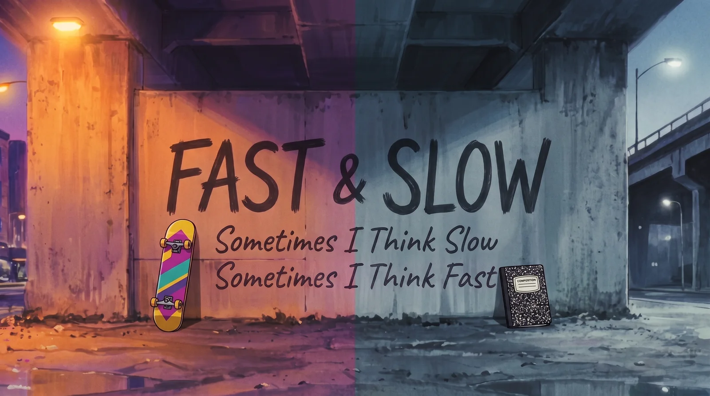

# Sometimes I Think Slow – AI Music Video

> I don't think slower, I think longer.

**▶ The video is coming soon to [transitivebullsh.it](https://www.transitivebullsh.it).**

An AI-made hip-hop parody of Nice & Smooth’s “Sometimes I Rhyme Slow” (1991), about the two ways AI models think: fast, in a single forward pass, and slow, reasoning at test time. It was made almost entirely by Claude Code with Opus 5.5, Suno, and fal. This repo is the whole working directory behind it.

## The slow MC isn’t slower, he’s longer

Daniel Kahneman’s *Thinking, Fast and Slow* splits the mind in two: System 1 is fast, automatic, and confidently wrong about the bat and the ball; System 2 is slow, deliberate, and expensive. Language models got their System 2 in 2024, when OpenAI’s o1 showed that accuracy keeps climbing if you let a model think longer at test time. That turned compute at inference into a second scaling axis next to training.

Nice & Smooth were already that duo. Greg Nice is bright, bouncy, and quick; Smooth B is low, silky, and slow. But measure it and Smooth doesn’t rap slower. He averages 10.6 syllables a bar to Greg’s 9.8. He just keeps going, 27 bars to Greg’s 17. Same speed per token, many more tokens. That’s a reasoning model.

So the parody barely needed a concept: swap “rhyme” for “think,” give each MC a mode, and let them trade verses about what each one is good at.

## FAST & SLOW

**FAST** is System 1: a skater with a wild mane who answers before you finish asking. **SLOW** is System 2: a ronin-cool reader with a notebook who takes three minutes and gets it right. They’re a brotherly, love-hate duo in the spirit of Samurai Champloo’s Mugen and Jin, and they work best together.

- **Verse 1 is FAST’s world,** in saturated 90s color: two thousand tokens a second, one forward pass, low effort still beating your high, Andrej Karpathy’s “no thinking, single token, low latency” sweet spot on a pager, a calendar that confidently says 2029, and the bat and the ball from Kahneman’s book.
- **Verse 2 is SLOW’s story,** drawn in monochrome sumi-e ink wash, with FAST as the only color in his memories: ten thousand agents deep on Navier–Stokes, rolling his twin back to an old checkpoint, catching him special-casing the tests, and a newsstand headline where Gary Marcus says he told you it would slip.
- **The hook** is a chalk mural of the o1 train-time and test-time compute charts under a dusk overpass, split warm and cool. By the last hook it’s sunrise, and they’re on the same mixer: one fader on LOW, one on MAX.

Real people only ever appear as in-world text: a pager, a CRT, a book cover, a newspaper. Every caption is part of the world too: FAST’s lines are spray tags, SLOW’s are handwriting, the hook is sign lettering, and the a cappella breaks are typed out on the tape.

## How it was made

Claude Code with **Opus 5.5** made nearly all of it: the lyric rewrite, the audio experiments, the storyboard, every image and video prompt, the compositor, and the review tools. My job was taste and feedback.

1. **Lyrics.** Rewritten line by line against the original’s bars, syllable counts, and rhyme placement. Only the hook keeps its shape.
2. **Song.** Suno V6, from text only: tagged lyrics plus a style prompt built from the original’s measured tempo and key, never its name.
3. **Timing.** A beat grid (beat_this) and Whisper word timestamps, aligned back to the script so every caption knows when each word lands.
4. **Look.** 90s hand-painted cel anime on VHS. Color follows the mode: warm and cool at the hook, saturated for FAST, ink wash for SLOW, golden at sunrise.
5. **Characters.** One model sheet each for FAST and SLOW, passed into every keyframe.
6. **Storyboard.** 66 shots, each starting on its lyric, with a scene, a camera move, and any in-world text.
7. **Keyframes.** One still per shot with Nano Banana Pro, conditioned on the style frame for its mode and the characters’ sheets.
8. **Clips.** Kling 3 Pro for color and action, and Wan 3.0 for SLOW’s calmer ink-wash verse. Shots that have to land somewhere (a readable “2029”, a pratfall) get first and last frames.
9. **Compositing.** A local Python compositor retimes the clips to the song, grades each mode, adds grain, scanlines, and chroma bleed, animates the captions word by word, and draws the VCR on-screen display.
10. **Review.** A scene-by-scene review tool with Approve / Change and a notes box per shot. My notes save to a file that Claude reads back as the next round.
11. **Poster.** The end card doubles as the first frame, since X shows a video’s first frame as its preview.

### Tools used

- **Claude Code (Opus 5.5):** director, producer, editor, and all of the code.
- **Suno V6:** the song.
- **fal:** Krea 2 for the style frames, Nano Banana Pro for character sheets and keyframes, and Kling 3 Pro and Wan 3.0 for video.
- **Local:** beat_this for the beat grid, mlx-whisper for word timings, audio-separator for the Suno take’s vocal stem, and Pillow + ffmpeg for the compositor.

### Tried and discarded

> 🗑️ None of this made it into the final video.

- **Voice auditions.** Before Suno, we auditioned rap voices from Lyria 3.5, Lyria 3 Pro, MiniMax Music 2.6 and 3, ACE-Step, ElevenLabs (music, TTS, and speech-to-speech), and Seed-VC. None of them had the laid-back 1991 delivery, so the song was generated fresh in Suno instead.
- **Lip-sync.** OmniHuman 1.5 animated nine close-ups. The cut plays better without them.
- **Other video models:** Veo 3.1 Lite (faithful, but tamer) and PixVerse v6 (reframed shots and drifted off-model).
- **Other image models for the style frames:** Seedream, next to Krea 2 and Nano Banana Pro.

## What I learned

- **Stills are cheap, video is expensive.** Lock every composition as a keyframe (15¢) before animating it (15¢–85¢ a clip).
- **Video models rewrite in-world text.** A scrawled “2029” became “4029”, and a camcorder date turned into gibberish. Pinning the keyframe as the last frame holds text in place; for anything that must not change, composite it back from the keyframe.
- **Check the end of every clip.** The last second is where characters drift off-model and cameras cut away. Use only the clean part, fitted to the shot.
- **One model per mode.** Kling handled action and color best; Wan was just as good, and cheaper, for calm ink-wash shots.
- **Scene-level feedback turns taste into prompts.** The first full render got 59 of 66 shots approved, and every note on the other seven became a specific, cheap redo.
- **Budget:** roughly $60 of fal credits.

## License

The code is [MIT](license) © [Travis Fischer](https://x.com/transitive_bs). The video is a parody, not affiliated with Nice & Smooth, any AI lab, or anyone it name-checks. The original song belongs to its owners.

---

Want to run the pipeline, redo a shot, or see where everything lives? See [contributing.md](contributing.md).
